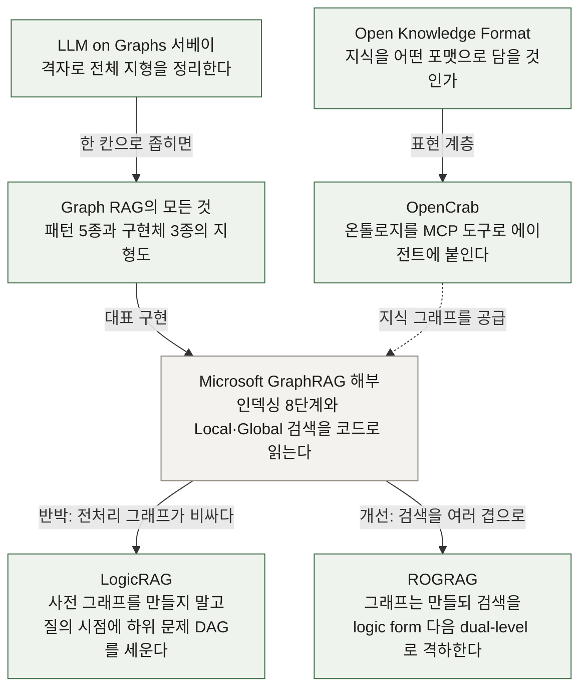
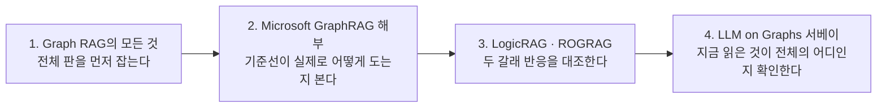

# GraphRAG 지식 지도

저장소에 쌓인 GraphRAG 계열 정리 7건이 서로 어디에 놓이는지 그린 지도입니다. 개별 노트는 각자 완결돼 있지만, **어느 것이 어느 것을 반박하고 보완하는지는 본문 링크로만 흩어져 있어** 따로 모았습니다.

- **기준 좌표계**: [LLM on Graphs 서베이](../papers/%5B20260910%5D%20LLM_on_Graphs_Comprehensive_Survey.md) (arXiv:2312.02783)
- **갱신**: 2026-09-11

## 범례

| 표시 | 뜻 |
| --- | --- |
| **읽음** | 저장소에 정리가 있습니다 |
| **부분** | 다른 노트에서 스쳐 지나갔고 전용 정리는 없습니다 |
| **빈칸** | 아직 다루지 않았습니다 |

## 좌표계: 그래프 시나리오 3종 × LLM 역할 3종

서베이가 제시한 격자입니다. **무엇이 최종 예측을 내놓느냐**로 역할이 갈립니다.

| | LLM as Predictor (LLM이 최종 출력) | LLM as Encoder (GNN이 최종 출력) | LLM as Aligner (LLM과 GNN을 정렬) |
| --- | --- | --- | --- |
| **Pure Graphs** 텍스트 없는 그래프 | **읽음** | 빈칸 | 빈칸 |
| **Text-Attributed Graphs** 노드·엣지에 텍스트 | **읽음** | 빈칸 | 빈칸 |
| **Text-Paired Graphs** 그래프 전체에 설명 | 부분 | 빈칸 | 빈칸 |

**읽은 것이 한 열에 몰려 있습니다.** 전부 `LLM as Predictor` 안의 `Graph as Sequence`, 곧 그래프를 텍스트로 풀어 컨텍스트에 넣는 방식입니다. GNN을 학습시키는 나머지 여섯 칸은 손대지 않았습니다.

## 계열 내부 관계

가운데 **Microsoft GraphRAG가 기준선**입니다. LogicRAG는 그 전처리 비용을 문제 삼아 그래프를 아예 없애자는 쪽이고, ROGRAG는 그래프를 유지한 채 검색 단계를 쌓는 쪽입니다. **같은 대상을 두고 정반대 방향으로 갈라집니다.**

## 노트 목록

| 노트 | 위치 | 역할 |
| --- | --- | --- |
| [LLM on Graphs 서베이](../papers/%5B20260910%5D%20LLM_on_Graphs_Comprehensive_Survey.md) | 최상위 좌표계 | 9칸 격자와 미해결 목록 |
| [Graph RAG의 모든 것](../blogs/%5B20260910%5D%20devto_Graph_RAG%EC%9D%98_%EB%AA%A8%EB%93%A0_%EA%B2%83.md) | 계열 지형도 | 디자인 패턴 5종, RAPTOR, MS GraphRAG, AWS Toolkit |
| [Microsoft GraphRAG 해부](../blogs/%5B20260908%5D%20TowardsAI_Microsoft_GraphRAG_%EB%8F%99%EC%9E%91%EC%9B%90%EB%A6%AC_%EB%8B%A8%EA%B3%84%EB%B3%84.md) | 기준선 각론 | 인덱싱 8단계, 토큰 예산 배분, 정렬 기준 |
| [LogicRAG](../papers/%5B20260702%5D%20LogicRAG_Adaptive_Reasoning_Structures.md) | 반박 | 질의 시점 DAG, rolling memory |
| [ROGRAG](../papers/%5B20260831%5D%20ROGRAG_Robustly_Optimized_GraphRAG.md) | 개선 | dual-level과 logic form 다단계, ablation |
| [Open Knowledge Format](../blogs/%5B20260614%5D%20PyTorchKR_Open_Knowledge_Format_OKF.md) | 표현 계층 | 지식 포맷 표준 제안 |
| [OpenCrab](../repos/%5B20260322%5D%20AlexAI-MCP_OpenCrab_MCP%EB%A1%9C_%EB%B6%99%EC%9D%B4%EB%8A%94_%EC%98%A8%ED%86%A8%EB%A1%9C%EC%A7%80_%EA%B3%B5%EC%9E%A5.md) | 구축 도구 | 온톨로지 공장, MCP 도구 30종 |

## 읽는 순서

처음 보는 사람에게 권하는 순서입니다.

서베이를 마지막에 두는 이유가 있습니다. **격자만 먼저 보면 추상적이라 안 남습니다.** 구체적인 구현을 먼저 읽고 나서 좌표를 확인해야 "우리가 한 열에만 있었구나"가 체감됩니다.

## 비어 있는 곳

지도를 그리고 나서 드러난 빈칸입니다.

- **LLM as Encoder 계열 전체.** LLM을 텍스트 인코더로만 쓰고 GNN이 최종 예측을 내는 방식입니다. 사내 문서망이나 이슈 트래커처럼 노드에 텍스트가 붙은 데이터에는 이쪽이 더 맞을 수 있는데 한 건도 없습니다.
- **LLM as Aligner 계열 전체.** 대조 학습으로 LLM 임베딩과 GNN 임베딩을 같은 공간에 맞추는 방식입니다.
- **Text-Paired Graphs.** 분자처럼 그래프 하나가 개체이고 캡션이 붙은 경우입니다. 서베이에서 개념만 읽었고 전용 정리는 없습니다.
- **LightRAG, HippoRAG, KAG.** 지형도 노트가 다루지 않았고 ROGRAG가 참고 구현으로 언급만 합니다.
- **비용 비교.** 일곱 건 중 어느 것도 인덱싱 LLM 호출 비용을 정량으로 다루지 않습니다. GraphRAG 계열 전체의 공통 공백입니다.

마지막 항목이 실무에서 가장 아픕니다. **구조는 일곱 건이나 읽었는데 "얼마나 드는가"에 답할 자료가 없습니다.**
