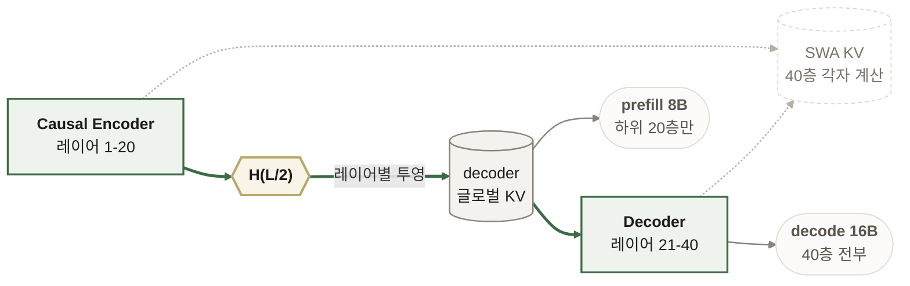
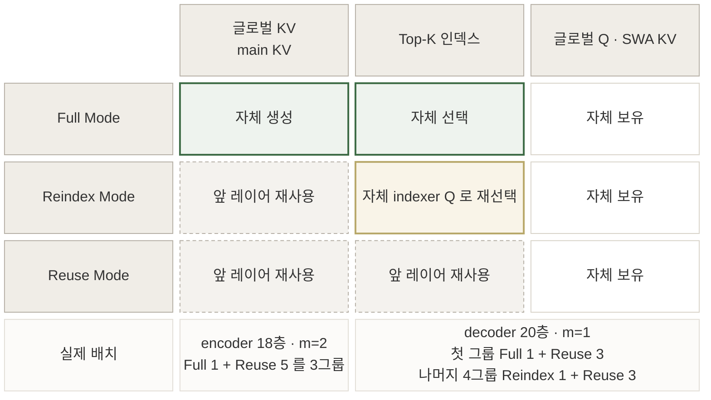
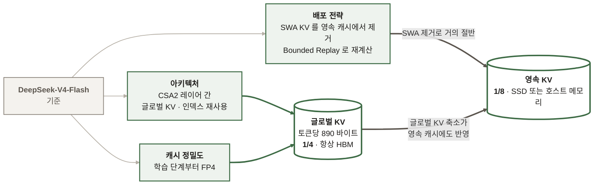

# DeepSeek-V4.1-Flash: KV 캐시를 토큰당 890바이트까지 줄이기

- **논문**: DeepSeek-V4.1-Flash: Pushing the Limits of KV Cache Compression
- **저자**: DeepSeek-AI (research@deepseek.com)
- **출처**: Hugging Face 배포 PDF `DeepSeek_V41_Tech_Report.pdf`, 51쪽
- **읽은 날짜**: 2026-09-11
- **태그**: #DeepSeek #KVCache #SparseAttention #MoE #LongContext #FP4 #Multimodal #AgenticWorkload

## 한 줄 요약

에이전트 워크로드가 **입력 중심(input-heavy)** 으로 바뀌면서 병목이 연산에서 **저장과 전송**으로 옮겨갔다는 진단 아래, 아키텍처·캐시 정밀도·배포 전략을 함께 건드려 글로벌 KV 캐시를 토큰당 890바이트(이전 세대의 약 1/4)로, 영속 KV 캐시를 약 1/8로 줄인 보고서.

## 읽는 방식

이 노트는 **원문 목차를 그대로 따라간다.** 절 번호와 제목이 원문과 같으므로 대조하며 읽을 수 있다. 마지막 두 절(읽을 때 감안할 것, 내 작업과의 연결)만 내가 붙인 것이다.

## 구조 한눈에 보기

원문 그림을 보지 않고도 세 가지만 잡으면 나머지가 따라옵니다.

### CED: 글로벌 KV 는 공유하고 SWA 는 공유하지 않는다

**초록 굵은 선이 공유 경로입니다.** decoder 20개 레이어는 글로벌 KV 를 자기 은닉 상태에서 만들지 않고, encoder 마지막 층의 은닉 상태 `H(L/2)` 에서 레이어별 투영 가중치로 한 번에 얻습니다. 그래서 prefill 은 하위 20층만 계산하면 되고 활성 파라미터가 8B 입니다. decode 는 40층을 다 쓰므로 16B 입니다.

**회색 점선인 SWA 만 이 공유에서 빠집니다.** 40개 레이어가 각자 자기 은닉 상태에서 계산합니다. 대신 그 비용을 Decoder SWA Bounded Replay 로 줄입니다. 프롬프트의 마지막 `n_win` 토큰만 prefill 해 `n_win × L/2` 를 피합니다.

### CSA2: 레이어마다 무엇을 만들고 무엇을 빌려 쓰나

**위에서 아래로 갈수록 초록이 사라지고 점선이 늘어납니다.** 그것이 곧 저장 비용이 줄어드는 방향입니다. 세 모드 모두 자기 글로벌 Q 와 자기 SWA KV 는 그대로 들고 있습니다. 공유하는 것은 글로벌 KV 와 indexer K 뿐입니다.

Reindex Mode 가 중간에 있는 이유가 있습니다. 글로벌 KV 는 빌려 쓰되 **자기 indexer Q 로 Top-K 를 다시 고릅니다.** 저장은 아끼면서 선택은 자기 층에 맞게 하는 절충입니다.

### 압축은 세 층위의 곱이다

**어느 하나만 떼어 적용하면 이 수치가 안 나옵니다.** 글로벌 KV 가 1/4 이 된 것은 아키텍처와 정밀도 둘의 결과이고, 영속 KV 가 1/8 이 된 것은 다시 두 곱셈 인자의 결과입니다. SWA KV 를 빼서 거의 절반, 남은 글로벌 KV 가 이미 1/4 이기 때문입니다.

---

## 1. Introduction

문제 설정이 이 보고서의 출발점이다. 장기 실행 에이전트가 늘면서 초장문 컨텍스트 처리가 주요 워크로드가 됐는데, **여기서 필요한 건 긴 시퀀스를 빨리 처리하는 것만이 아니라 큰 KV 캐시를 저장하고 재사용하고 옮기는 일**이다.

앞선 sparse attention 연구가 연산 비용을 이미 크게 줄여놓아서, **저장과 데이터 이동이 오히려 두드러진 병목**이 됐다는 것이 핵심 진단이다.

이전 세대인 DeepSeek-V4의 구조를 이렇게 요약한다. 전체 컨텍스트를 보는 글로벌 어텐션 branch와 지역적인 Sliding-Window Attention(SWA)을 결합한 형태다.

- **글로벌 KV** = main KV + indexer K. 시퀀스가 충분히 길면 이쪽이 런타임 KV 사용량을 지배하고 HBM 용량에 걸린다
- **SWA KV**는 윈도 크기가 고정이라 시퀀스 길이와 무관하게 상한이 있다
- 일부 KV는 prefix 재사용을 위해 **영속 KV 캐시**로 남는데 이쪽은 SSD와 호스트 메모리 용량에 걸린다

V4.1-Flash의 제원과 성과를 서론에서 정리한다.

| 항목 | 값 |
|------|-----|
| 백본 파라미터 | 552B (MoE, 멀티모달) |
| 컨텍스트 | 최대 100만 토큰 |
| **prefill 활성 파라미터** | **8B** |
| **decode 활성 파라미터** | **16B** |
| 글로벌 KV (항상 HBM) | 토큰당 890바이트, V4-Flash의 약 1/4 |
| 영속 KV (SSD 또는 호스트 메모리) | V4-Flash의 약 1/8 |

**prefill에서 8B만 활성화되는 것이 이 설계의 핵심 이득이다.** 에이전트 워크로드는 툴 호출 때문에 prefill 요청이 잦은데, 그 구간의 단가를 절반으로 떨어뜨린다.

압축은 세 층위에서 동시에 이뤄진다.

- **아키텍처**: CSA2가 글로벌 KV(main KV와 indexer K)와 Top-K 인덱스를 레이어 간에 재사용한다
- **캐시 정밀도**: 학습 때부터 FP4 글로벌 KV 캐시를 쓴다. 성능 저하는 미미하다고 밝힌다
- **배포 전략**: SWA Bounded Replay로 SWA KV를 SSD에 영속화하지 않는다

관점 하나가 설계 전체를 이끈다. **"V4는 SWA 기반 지역 처리 backbone에 압축된 글로벌 컨텍스트를 붙인 것으로 볼 수 있다."** 그래서 지역 어텐션 설계는 대체로 보존하고 글로벌 branch를 단순화하는 데 집중했다.

V4가 CSA와 HCA를 섞은 하이브리드였던 것과 달리 **V4.1-Flash는 순수 CSA2**를 쓴다.

서론 말미의 능력 평가가 솔직한 편이다.

- **Reasoning**: 수학과 경쟁 프로그래밍 같은 추론 집약 벤치마크에서 Kimi-K3, DeepSeek-V4-Pro 같은 최상위 오픈소스 모델과 비슷한 수준
- **Agent**: Terminal-Bench 2.1, DeepSWE v1.1, AutomationBench에서 폐쇄형 프런티어 모델과 대등. **다만 전문 도메인 지식이 필요한 과학 지향 과제(Terminal-Bench 4.0)에서는 거대 모델과 격차가 남는다**
- **Multimodal**: 시각 추론과 전문 차트 해석에서 Kimi-K3를 넘어선다. 프런트엔드 개발이나 오피스 자동화처럼 화면 캡처를 보고 자가 수정하는 워크플로에서 실용성을 보인다. **거대 폐쇄형 시스템과는 전반적 격차가 남는다고 인정한다**

## 2. Architecture

### 2.2 Causal Encoder-Decoder (CED)

YoCo에서 출발한 구조다. YoCo는 상위 절반 레이어가 하위 절반이 만든 KV 캐시를 그대로 공유해 prefill 연산을 줄인다. CED는 여기에 구조적 개선을 더해 KV 용량과 KV 생성의 연산 깊이를 함께 키웠다.

동작은 이렇다.

- **글로벌 어텐션**: 하위 `L/2` 레이어가 causal encoder다. 상위 절반(decoder)의 KV는 자기 레이어의 은닉 상태가 아니라 **`L/2`번째 레이어의 은닉 상태에서 레이어별 투영 가중치로 직접 만든다**
- **SWA**: 모든 레이어에서 기존대로 레이어별 계산을 유지한다. 지역 KV 생성의 연산 깊이를 확보하기 위해서다

그런데 SWA를 레이어별로 계산하면 decoder의 SWA KV를 위해 prefill에서 `n_win × L/2` 토큰을 추가 처리해야 한다. 짧은 프롬프트가 오가는 멀티턴에서는 이 비용이 무시할 수 없다.

**Decoder SWA Bounded Replay**가 여기서 나온다. 선행 연구가 SWA의 실제 유효 수용 영역이 이론값보다 훨씬 작다고 보였으므로, **프롬프트의 마지막 `n_win` 토큰만 prefill한다.**

결과적으로 `N >> n_win`일 때 prefill 복잡도가 `O(NL)`에서 `O(NL/2)`로, 사실상 절반이 된다.

### 2.3 Compressed Sparse Attention 2 (CSA2)

KV 비용을 줄이는 축을 셋으로 정리한 대목이 개념 정리에 좋다.

| 축 | 방법 | 선행 연구 |
|----|------|-----------|
| **entry 크기** | KV 헤드 수를 줄이거나 작은 latent를 헤드끼리 공유 | GQA, MLA |
| **시퀀스 차원** | `m`개 토큰을 1개 엔트리로 압축 | V4의 CSA와 HCA |
| **레이어 차원** | 일부 레이어가 다른 레이어의 캐시와 선택을 재사용 | IndexCache, YOIO, HySparse |

선행 연구의 한계를 짚는다. **인덱스 재사용만으로는 main KV 저장을 아끼지 못한다.**

CSA2는 레이어마다 **정적으로 배정된 세 가지 모드**로 동작한다.

| 모드 | 글로벌 KV | Top-K 인덱스 | 동작 |
|------|-----------|-------------|------|
| **Full** | 자체 생성 | 자체 선택 | 글로벌 KV를 만들고 인덱싱 수행 |
| **Reindex** | 앞 레이어 것 재사용 | **자체 재선택** | 자기 indexer Q로 공유된 indexer K를 다시 점수 매겨 새 Top-K 선택 |
| **Reuse** | 앞 레이어 것 재사용 | 앞 레이어 것 재사용 | 바로 sparse attention 수행 |

**세 모드 모두 자기 글로벌 Q와 SWA KV는 유지한다.** 공유하는 것은 글로벌 KV와 indexer K다.

### 2.4 Efficient Architectural Extensions

V4 아키텍처를 정리하면서 네 가지를 더했다.

- **Single-Pass mHC**: 기존 mHC를 개선. Mega-mHC 배포 커널이 4커널 구현 대비 활성화 메모리 트래픽을 절반으로 줄인다
- **Engram**: 조건부 메모리 모듈을 통합해 모델 능력을 보강
- **DSpark**: 반자기회귀 draft 생성과 confidence 스케줄 검증을 쓰는 speculative decoding 아키텍처
- **FP4 Main KV Cache**: 학습 단계부터 FP4 글로벌 KV 캐시 사용

## 3. General Infrastructures

### 3.2 Inference System

배포 수준에서 **Encoder-Prefill-Decode(EPD) 분리**를 쓴다. 비전 인코딩, prefill, decode가 독립적으로 확장되고 실행이 겹친다.

커널 수치가 인상적이다. **CSA2 Reuse Mode 레이어는 prefill에 15개, decode에 11개 커널로 실행된다.**

### 3.2.1 Persistent KV Cache Management

영속 KV가 1/8이 된 이유를 두 곱셈 인자로 설명한다.

1. **영속 캐시가 SWA KV를 더 이상 저장하지 않는다.** 이것만으로 거의 절반이 준다
2. 남은 글로벌 KV가 아키텍처와 정밀도 최적화로 다시 1/4이 된다

V4에서 SWA KV가 영속 캐시 용량의 거의 절반을 차지했는데, 저자들의 진단이 날카롭다. **"SWA KV를 영속 저장하는 것은 비싸고 효과도 없다. 접근 패턴이 영속 캐시의 긴 보존 정책과 맞지 않기 때문이다."**

글로벌 KV는 롱테일 재사용을 보이지만, **SWA KV는 활성 세션 안의 분 단위 좁은 창에서만 재사용되고 세션이 끝나거나 다음 턴이 시작되면 죽는다.**

그래서 V4.1은 이렇게 바꿨다.

- **SWA KV**: 영속 캐시에서 빼고 각 머신 호스트 DRAM의 10%로 만든 분산 메모리 풀에 둔다. 총 용량은 훨씬 작지만 **TTL이 분 단위라 만료 항목이 즉시 재활용**되고, 실제 워크로드에서 이 높은 회전율만으로 동시 활성 세션 대부분을 감당한다
- **글로벌 KV**: 영속 캐시에 남고 최소 72시간 수명을 보장한다
- **미스 대응**: 글로벌 KV는 맞고 SWA KV만 놓친 요청에 **Encoder SWA Bounded Replay**로 `L × n_win`이 아니라 `n_win` 토큰만 재계산한다

마지막 문장이 설계의 요점이다. **"이 bounded replay가 설계의 초석이다. 치명적인 미스를 값싸고 점진적인 성능 저하로 바꾸기 때문에, SWA KV를 영속 캐시에서 빼는 결정이 정당화된다."**

## 4. Pre-Training

### 4.1 Data Construction

멀티모달 데이터 쪽 판단이 눈에 띈다. **대규모 합성을 하지 않고 원본 형태 그대로 정제해 쓰는 쪽을 택했다.** 웹 원본 데이터가 이미 풍부한 멀티모달 지식을 준다는 전제에서다.

- 초기 수집에서 크롤링 시스템이 텍스트 중심 웹 콘텐츠에 치우쳐 있음을 발견하고 **Common Crawl에서 다시 부트스트랩**했다
- interleaved 데이터는 비용이 커지는 순서로 단계를 나눴다. 이미지 검색 전에 휴리스틱·통계 필터링, 중복 제거, 품질 모델로 고가치 문서를 먼저 거른다
- SmolVLM으로 이미지-텍스트 내용에 엄격한 품질 점수를 매긴다. 걸러진 문서는 일부 재조합해 image-text pair로 회수한다
- 최종 코퍼스는 텍스트 전용과 멀티모달의 합집합이고 **토큰 비율은 7:1**이다. best-fit packing으로 **패딩률을 최대 1e-4**까지 낮췄다

합성 데이터에 대한 경계도 적었다. **기존 정보를 재구성하는 데 그치며 긴 학습 구간에서는 해로울 수 있다**는 것이다.

### 4.2.1 Model Setups

구성이 구체적으로 공개돼 있다.

| 항목 | 값 |
|------|-----|
| 레이어 수 | 40 (encoder 20 + decoder 20) |
| hidden dimension | 5120 |
| 첫 2개 레이어 | 순수 SWA |
| encoder 나머지 18개 | CSA2, 압축률 `m=2`. 6개씩 3그룹, 각 그룹은 Full 1 + Reuse 5 |
| decoder 20개 | CSA2, 압축률 `m=1`. 4개씩 5그룹. 첫 그룹은 Full 1 + Reuse 3, 나머지 4그룹은 **Reindex 1 + Reuse 3** |
| indexer | query head 32, head dim 128 |
| attention top-k | 512 |
| query | head 64, head dim 512, 압축 차원 1280 |
| Hierarchical Sparse Indexer | 최대 2,048 블록 × 8 위치 = 후보 16,384 위치 |

### 4.3 Evaluations

학습 설정에서 눈에 띄는 대목이 있다. **45T 토큰 멀티모달 코퍼스로 학습했고, sparse attention을 64K 시퀀스 길이에서 처음부터 학습했다. dense attention 워밍업 단계가 없다.**

Base 모델 결과는 이렇다. **DeepSeek-V4-Pro-Base와 비슷한 지식·추론·코딩 능력을 보이면서, held-out 평가에서 5~10% 개선을 냈다. 전체 파라미터는 1/3, 활성 파라미터는 1/4다.**

## 5. Post-Training

이 절의 첫 문장이 가장 정직한 대목이다. **"위에서 설명한 아키텍처 혁신과 달리, post-training에는 알고리즘 혁신이 없다."** SFT 다음 RL, 그다음 on-policy distillation(OPD)이라는 표준 절차를 V4 개발에서 쓰던 그대로 따랐다고 밝힌다.

**모든 실질적 변화는 데이터 파이프라인에 있다.** 데이터 합성과 환경 구축을 자동화하고, RL에 쓰는 데이터·과제·rollout을 점진적으로 확장했다.

주요 구성요소는 목차 기준으로 이렇다.

- **5.1.1 Large-Scale Agent Task Synthesis**: 대규모 에이전트 과제 합성
- **5.1.2 RL in Synthesized Tasks**: 합성 과제에서의 RL
- **5.1.3 Running Agents at Massive Scale: DSec**: 대규모 에이전트 실행 환경
- **5.1.4 Controllable Reasoning Effort in RL**: 추론 노력을 제어 가능하게 만드는 RL
- **5.2 Asynchronous Post-training Infrastructure**: 길이 편향과 off-policy 효과 완화, 대규모 on-policy distillation

평가는 추론 노력별(5.3.3), 에이전트 scaffold별(5.3.4), 멀티 에이전트(5.3.5)로 나눠 보고한다. **scaffold별로 따로 재는 구성이 실무에 유용하다.** 같은 모델도 harness가 바뀌면 결과가 달라진다는 전제를 평가 설계에 넣은 것이다.

## 6. Conclusion, Limitations, and Future Directions

한계 서술이 이 보고서에서 가장 읽을 만하다.

- **아키텍처 단순화가 아직 특성화되지 않은 견고성 경계를 만들었다.** 내부 평가가 다양한 경계 조건을 다뤘고 체계적 성능 저하는 관찰되지 않았지만, **"어떤 유한한 테스트 스위트도 모든 극단 입력과 배포 조건을 덮을 수 없다"** 고 적는다
- 구체적으로 **CSA2의 선택 오류**와 **SWA Bounded Replay의 근사 상태 재구성**이 미검증 경계에서 성능 저하를 낳을 수 있다고 지목한다
- 앞으로 **장문 컨텍스트에서의 sparse 검색**과 **캐시 재개 경계에서의 SWA 상태 재구성**에 특히 주의해 스트레스 테스트를 확장하겠다고 밝힌다

벤치마크에 대한 인식도 분명하다. **"벤치마크 점수가 좁은 차이를 보인다고 해서, 복잡하고 어려운 추론과 엣지 케이스에서 선도 폐쇄형 시스템의 프런티어 능력에 도달했다는 뜻은 아니다."** Fable-5, GPT-6 Astra에 근접하고 일상 사용에서 비슷한 경험을 주지만 가장 어려운 과제에서는 격차가 남는다는 서술이다.

향후 방향으로 **model-harness co-design**을 명시한 점이 눈에 띈다. 모델과 실행 환경을 함께 진화시키겠다는 것이다.

---

## 읽을 때 감안할 것

- **자체 보고 벤치마크다.** 비교 대상이 자사 이전 모델(V4-Flash, V4-Pro)에 몰려 있고, 외부 모델 비교는 Kimi-K3, GLM-5.3 정도다. 재현 가능한 평가 스크립트나 원시 결과가 공개됐는지는 본문에 없다.
- **"실제 과제의 95% 이상을 완수할 수 있다"는 주장의 근거가 없다.** 어떤 과제 집합에서 어떻게 쟀는지 서술이 따라오지 않는다. 인용할 값이 아니다.
- **CSA2 모드 배치가 손으로 정한 정적 구성이다.** encoder는 Full 1 + Reuse 5, decoder는 Reindex 1 + Reuse 3인데 **왜 이 비율인지에 대한 ablation이 본문에 보이지 않는다.** 다른 배치에서 얼마나 나빠지는지가 이 설계의 핵심 근거일 텐데 빠져 있다.
- **FP4 KV의 "미미한 성능 저하"에 수치가 없다.** 학습 단계부터 FP4를 쓴다는 것이 압축의 큰 축인데, 초록과 서론 모두 정성 표현으로만 넘어간다.
- **SWA Bounded Replay의 근사 오차도 정성 서술이다.** "negligible performance degradation"이라고만 한다. 저자들 스스로 한계 절에서 이 부분을 위험 요소로 꼽았으므로 수치가 있어야 할 자리다.
- **prefill 8B와 decode 16B는 활성 파라미터 기준이다.** 백본 552B가 별도로 있으므로 메모리 요구를 활성 파라미터로만 판단하면 안 된다.

## 내 작업과의 연결

1. **KV 캐시가 비용의 중심이라는 진단이 일관된다**

   [서빙 구조 노트](../blogs/%5B20260908%5D%20Notion_%EC%84%9C%EB%B9%99%EA%B5%AC%EC%A1%B0%EA%B0%80_LLM_%EC%B2%98%EB%A6%AC%EB%9F%89%EC%9D%84_%EB%B0%94%EA%BE%B8%EB%8A%94_%EB%B0%A9%EC%8B%9D.md)에서 `vllm:kv_cache_usage_perc`를 못 보면 병목 진단이 막힌다고 정리했는데, 이 보고서는 그 KV 자체를 줄이는 쪽이다. **모델 설계와 서빙 운영이 같은 지점을 놓고 각자 접근하는 구조**다.

2. **영속 캐시 설계 원칙이 일반화된다**

   **"접근 패턴이 보존 정책과 맞지 않으면 캐시하지 말라"** 는 판단은 KV 캐시 밖에도 적용된다. 분 단위로만 쓰이는 데이터를 72시간 보존 계층에 두는 것이 낭비라는 관찰, 그리고 미스를 감당 가능한 재계산으로 바꿔 캐시를 아예 없앤 설계는 [EKS 콜드 스타트 노트](../blogs/%5B20260910%5D%20AWS%EB%B8%94%EB%A1%9C%EA%B7%B8_EKS_vLLM_Gemma4_%EC%BD%9C%EB%93%9C%EC%8A%A4%ED%83%80%ED%8A%B8_%EC%B5%9C%EC%A0%81%ED%99%94.md)의 "제외 기술에 근거와 재검토 조건을 붙이기"와 같은 결의 판단이다.

3. **prefill과 decode의 비용 구조를 나눠 보기**

   에이전트 워크로드가 input-heavy라 prefill이 잦다는 전제에서 **prefill 활성 파라미터만 절반으로 줄인 설계**는 워크로드 특성이 아키텍처를 바꾼 사례다. 우리 파이프라인도 검색 컨텍스트가 길고 생성이 짧은 형태라면 같은 비대칭이 있다.

4. **scaffold별로 성능을 따로 재기**

   5.3.4에서 에이전트 scaffold별 결과를 분리해 보고한 점은 평가 설계에 옮길 만하다. **모델 성능과 harness 성능을 한 숫자로 뭉치면 어느 쪽을 고쳐야 할지 알 수 없다.**

5. **한계를 위험 목록으로 적는 형식**

   CSA2 선택 오류와 SWA 근사 재구성을 구체적으로 지목하고 앞으로 어디를 스트레스 테스트하겠다고 적은 형식이 좋다. "한계가 있다"가 아니라 **"어느 기제가 어떤 조건에서 깨질 수 있다"** 로 쓰면 후속 작업이 정해진다.

## 결론

**압축이 한 기법이 아니라 세 층위의 합이라는 점**이 이 보고서의 구조다. 아키텍처(CSA2의 레이어 간 재사용), 정밀도(FP4), 배포(SWA Bounded Replay)가 각각 곱해져 글로벌 1/4, 영속 1/8이 나온다. 어느 하나만 떼어 적용하면 이 수치가 안 나온다.

가장 배울 대목은 **"SWA KV는 영속 캐시에 맞지 않는 접근 패턴"** 이라는 관찰과, 그래서 캐시를 없애고 미스를 값싼 재계산으로 바꾼 결정이다. 캐시 계층을 설계할 때 용량이 아니라 **수명과 재사용 패턴**을 먼저 보라는 이야기다.

다만 핵심 근사 두 개(FP4 KV, Bounded Replay)의 성능 저하가 모두 정성 서술로만 남아 있다. 저자들 스스로 한계 절에서 이 둘을 위험으로 꼽았으므로, **수치 없이 인용하지 않는 편이 안전하다.**
