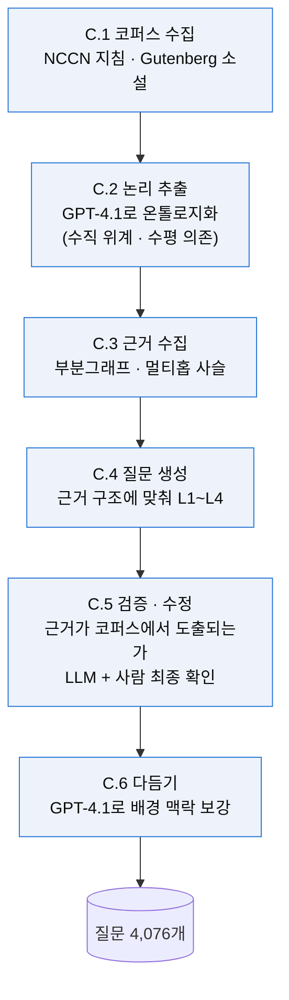

# GraphRAG-Bench: RAG에 그래프는 언제 필요한가

- **논문**: [When to use Graphs in RAG: A Comprehensive Analysis for Graph Retrieval-Augmented Generation](https://arxiv.org/abs/2506.05690)
- **저자**: Zhishang Xiang, Chuanjie Wu, Qinggang Zhang, Shengyuan Chen, Zijin Hong, Xiao Huang, Jinsong Su (샤먼대, 홍콩이공대, 7명)
- **arXiv**: 2506.05690 [cs.CL], v3 2026-02-22. ICLR 2026 게재본
- **코드·데이터**: [GraphRAG-Bench/GraphRAG-Benchmark](https://github.com/GraphRAG-Bench/GraphRAG-Benchmark)
- **실험 환경**: 생성 GPT-4o-mini(부록에 Qwen2.5 3B·7B·14B), 임베딩 bge-large-en-v1.5, 생성 온도 0.7. RAG는 256토큰 청크 top-5, GraphRAG는 각 프레임워크 기본 설정
- **읽은 날짜**: 2026-09-29
- **태그**: #GraphRAG #Benchmark #HippoRAG2 #ContextRelevance #TokenCost #MultiHopQA

## 한 줄 요약

사실 하나를 찾는 질문에는 **RAG가 GraphRAG와 같거나 낫고**, 여러 사실을 엮어야 하는 질문부터 그래프가 앞선다. 다만 이 경향은 느슨한 서사(소설) 코퍼스에서 뚜렷하고, 위계가 분명한 의료 지침에서는 GraphRAG 대부분이 rerank RAG를 넘지 못한다. 11종 중 **HippoRAG2만 RAG 수준의 프롬프트 길이와 관련도를 유지하면서** 어려운 과제에서 앞선다.

## 읽는 방식

**원문 목차를 그대로 따라간다.** 절 번호와 제목이 원문과 같다. 마지막 세 절만 읽는 쪽에서 덧붙인 것이다.

---

## 1 Introduction

GraphRAG는 문서 조각 사이의 관계를 그래프로 잡아 두면 더 일관된 검색이 된다는 발상이다. 그런데 선행 분석들은 반대 결과를 보고해 왔다.

- Han et al.(2025): Natural Questions에서 GraphRAG 정확도가 vanilla RAG보다 **13.4% 낮고**, 실시간 갱신이 필요한 질문에서는 16.6% 낮다
- Zhou et al.(2025): HotpotQA 멀티홉에서 추론 깊이가 4.5% 오르지만 **지연은 평균 2.3배**

저자들은 기존 벤치마크가 그래프의 효용을 재기에 부적합하다고 본다. 두 가지 이유다.

1. **과제 난도가 한 축뿐이다**: 흩어진 사실을 찾는 **검색 난도**만 있고, 찾은 사실을 엮는 **추론 난도**가 없다. "Kjaer Weis 창업자는 누구이고 어느 도시 출신인가" 같은 멀티홉 질문은 사실 두 개를 순서대로 꺼내면 끝난다
2. **코퍼스의 정보 밀도가 낮다**: 위키백과와 뉴스 기반이라 개념 사이의 위계나 논리 연결이 거의 없다. 그래프로 만들어도 이어지는 것이 적다

그래서 난도가 단계적으로 오르는 과제, 밀도가 다른 두 코퍼스, 구축·검색·생성 단계별 지표를 갖춘 벤치마크를 만든다.

## 2 Preliminary Study

### 2.1 RAG vs. GraphRAG

| | RAG | GraphRAG |
|---|---|---|
| 색인 | 청크로 자르고 임베딩 | 엔티티·관계를 뽑아 그래프 구축 |
| 검색 | 의미 유사도 상위 K개 청크 | 관련 노드에서 시작해 부분그래프를 순회 |
| 강점 | 낮은 프롬프트 비용, 전처리 최소 | 암묵적 관계, 간접 근거, 주제의 흐름 |
| 약점 | 청크 사이 관계를 놓침, 추론을 LLM에 전적으로 의존 | 그래프 구축 비용, **프롬프트 팽창** |

### 2.2 Current RAG Benchmarks

기존 벤치마크의 한계를 세 가지로 정리한다.

- **추론 난도 부재**: 멀티홉이 "사실 여러 개를 차례로 꺼내기"에 그친다
- **낮은 정보 밀도**: 1천 토큰당 엔티티·관계 수, 평균 차수가 낮다(아래 부록 Table 13)
- **최종 답만 채점**: 그래프 구축·검색·생성 중 어디서 실패했는지 모른다

질문 유형 분포도 치우쳐 있다. UltraDomain은 97%가 맥락 요약, HotpotQA는 78.2%가 사실 검색이고, MultiHop-RAG에는 사실 검색 질문이 없다.

## 3 GraphRAG-Bench

### 3.1 Task Formulation

난도를 네 단계로 나눈다.

| 단계 | 과제 | 요구 사항 | 예시 |
|---|---|---|---|
| L1 | 사실 검색 | 떨어진 지식 하나를 찾는다. 키워드 매칭 위주 | 몽생미셸은 프랑스 어느 지역에 있는가 |
| L2 | 복합 추론 | 여러 문서의 지식을 논리로 잇는다 | Hinze와 Felicia의 합의는 영국 통치자에 대한 인식과 어떻게 연결되는가 |
| L3 | 맥락 요약 | 조각난 정보를 구조 있는 답으로 합친다 | 콘월 뱃사공 John Curgenven은 방문객들에게 어떤 역할을 하는가 |
| L4 | 창작 생성 | 검색한 내용 너머를 추론한다. 가정·새 상황 | King Arthur와 Curgenven의 비교 장면을 신문 기사로 다시 써라 |

난도는 두 수치로 통제한다. **지식 폭**(답에 필요한 트리플 수)과 **추론 깊이**(트리플 사이 추론 홉 수)다(부록 Table 8).

| | L1 | L2 | L3 | L4 |
|---|---|---|---|---|
| 소설 · 지식 폭 | 1.40 | 2.60 | 3.51 | 7.11 |
| 소설 · 추론 깊이 | 1.69 | 6.25 | 4.64 | 7.81 |
| 의료 · 지식 폭 | 1.25 | 3.45 | 5.10 | 10.14 |
| 의료 · 추론 깊이 | 1.82 | 5.23 | 4.27 | 8.27 |

L2가 L3보다 추론 깊이가 깊다. 단계 번호가 두 축 모두에서 단조 증가하는 것은 아니다.

### 3.2 Dataset Construction

두 코퍼스를 쓴다.

- **의료**: 미국 NCCN 암 진료 지침. 증상·약물·치료 결과가 위계로 묶인 **구조가 뚜렷한** 텍스트
- **소설**: Project Gutenberg의 20세기 이전 소설. 사전학습 데이터와 겹치지 않도록 덜 알려진 작품 위주. **관계가 암묵적인** 서사

질문은 여섯 단계로 만든다(부록 C).



L1은 작은 부분그래프 하나, L2는 짧은 추론 사슬, L3는 떨어진 부분그래프 여럿, L4는 그래프 전체 구조에서 질문을 만든다. **질문 자체가 LLM이 만든 그래프에서 나온다**는 점은 뒤의 "읽을 때 감안할 것"에서 다시 짚는다.

### 3.3 Evaluation Metrics

파이프라인 단계마다 지표를 둔다.

| 단계 | 지표 | 뜻 |
|---|---|---|
| 색인 | 노드 수 · 엣지 수 | 그래프 규모 |
| 색인 | 평균 차수 · 평균 군집 계수 | 연결 정도, 이웃끼리도 이어진 정도 |
| 검색 | 근거 재현율 | 답에 필요한 근거를 다 가져왔는가 |
| 검색 | 문맥 관련도 | 가져온 문맥이 질문과 맞는가 |
| 생성 | ROUGE-L | 정답과의 단어 겹침 |
| 생성 | ACC | 0.75 × 사실 일치 F1 + 0.25 × 임베딩 유사도 |
| 생성 | 충실도(FS) | 답의 주장이 검색 문맥에 있는가 |
| 생성 | 근거 포함도(Cov) | 필요한 근거가 답에 다 들어 있는가 |

평균 군집 계수는 이웃끼리도 서로 이어진 정도(삼각형 비율)다. 질병·치료·증상처럼 촘촘한 묶음이 많으면 높다. ACC, 충실도, 근거 포함도, 재현율, 관련도는 모두 LLM이 주장 단위로 판정하는 지표다.

## 4 Experiment

연구 질문은 넷이다. Q1 생성 정확도, Q2 검색 품질, Q3 그래프 구조, Q4 토큰 비용.

비교 대상은 RAG 두 가지(rerank 유무)와 GraphRAG 11종(MS-GraphRAG local·global, HippoRAG, HippoRAG2, LightRAG, Fast-GraphRAG, RAPTOR, Lazy-GraphRAG, KGP, StructRAG, KET-RAG)이다. 본문 표에는 일부만 싣고 전체는 부록 Table 9·10에 있다.

### 4.1 Generation Accuracy (Q1)


주요 수치(Table 3·9, ACC)는 다음과 같다.

| 방법 | 소설 L1 | L2 | L3 | L4 | 의료 L1 | L2 | L3 | L4 |
|---|---|---|---|---|---|---|---|---|
| RAG (rerank) | **60.92** | 42.93 | 51.30 | 38.26 | 64.73 | 58.64 | 65.75 | 60.61 |
| HippoRAG2 | 60.14 | **53.38** | 64.10 | **48.28** | **66.28** | **61.98** | 63.08 | **68.05** |
| MS-GraphRAG local | 49.29 | 50.93 | **64.40** | 39.10 | 38.63 | 47.04 | 41.87 | 53.11 |
| MS-GraphRAG global | 36.92 | 43.17 | 56.87 | 41.11 | 16.42 | 15.61 | 19.82 | 20.81 |
| LightRAG | 58.62 | 49.07 | 48.85 | 23.80 | 63.32 | 61.32 | 63.14 | 67.91 |
| Fast-GraphRAG | 56.95 | 48.55 | 56.41 | 46.18 | 60.93 | 61.73 | **67.88** | 65.93 |
| RAPTOR | 49.25 | 38.59 | 47.10 | 38.01 | 54.07 | 53.20 | 58.73 | 62.38 |

- **관찰 1. 사실 검색에서는 RAG가 GraphRAG와 같거나 낫다.** 소설 L1에서 11종 모두 rerank RAG보다 낮다. 그래프가 끌어오는 곁가지 정보가 단순한 질문에는 잡음이 된다
- **관찰 2. 복합 추론, 맥락 요약, 창작 생성에서는 GraphRAG가 앞선다.** 소설에서는 L2·L3·L4 각각 11종 중 8·7·9종이 RAG를 넘는다. **의료에서는 3·1·7종**뿐이다. 저자들은 이 차이를 따로 논의하지 않는다
- **관찰 3. 창작 생성에서 GraphRAG의 사실 충실도가 높다.** 저자는 RAPTOR 충실도 70.9%가 소설에서 가장 높다고 쓰지만, 같은 표에서 HippoRAG가 71.53%, 부록의 MS-GraphRAG global이 75.15%로 더 높다

### 4.2 Retrieval Performance (Q2)


- **관찰 4. 단순 질문에서는 RAG가 필요한 근거를 잘 찾는다.** 소설 L1 근거 재현율 83.2%. L1 근거는 대개 한 단락 안에 있다
- **관찰 5. 질문이 어려워질수록 그래프의 재현율 이점이 드러난다.** 소설 L2~L3에서 HippoRAG 재현율 87.9~90.9%, HippoRAG2 관련도 85.8~87.8%
- **관찰 6. 창작 과제에서는 재현율과 관련도가 맞바뀐다.** MS-GraphRAG global 재현율 83.1%, RAG 관련도 78.8%

그림으로 보면 경향이 더 분명하다. **그래프 방식 대부분은 재현율을 얻는 대신 관련도를 크게 잃는다.** 의료에서 MS-GraphRAG local의 관련도는 2.8~5.7%, global은 2.7~11.7%다. 가져온 문맥의 대부분이 질문과 무관하다는 뜻이다. HippoRAG2만 관련도를 RAG 수준(79~88%)으로 유지한다.

### 4.3 Graph Complexity (Q3)

**관찰 7. 프레임워크마다 만드는 그래프 구조가 크게 다르다.** 1만 토큰당 HippoRAG2는 소설에서 노드 523개·엣지 2,310개, 의료에서 노드 598개·엣지 3,979개로 다른 방법보다 훨씬 촘촘하다.

| 지표 | MS-GraphRAG | HippoRAG2 | LightRAG | Fast-GraphRAG | HippoRAG |
|---|---|---|---|---|---|
| 소설 평균 차수 | 1.48 | **8.75** | 2.10 | 3.19 | 1.73 |
| 소설 평균 군집 계수 | 0.315 | **0.657** | 0.212 | 0.324 | 0.100 |
| 의료 평균 차수 | 1.82 | **13.31** | 2.58 | 5.50 | 2.06 |
| 의료 평균 군집 계수 | 0.300 | **0.497** | 0.139 | 0.347 | 0.087 |

HippoRAG2는 엔티티(구 단위) 노드와 원문 단락 노드를 함께 두고 동의어 엣지로 잇기 때문에 차수가 높다. 저자들은 이 밀도가 높은 재현율로 이어졌다고 해석한다.

### 4.4 Efficiency (Q4)


| 방법 | 소설 | 의료 |
|---|---|---|
| vanilla RAG | 879 | 954 |
| HippoRAG2 | 1,008 | 1,020 |
| RAPTOR | 3,441 | 3,510 |
| Fast-GraphRAG | 4,204 | 4,298 |
| HippoRAG | 7,208 | 7,342 |
| MS-GraphRAG local | 38,707 | 39,821 |
| LightRAG | 100,832 | 100,310 |
| MS-GraphRAG global | 331,375 | 332,881 |

- **관찰 8. GraphRAG는 프롬프트를 크게 늘린다.** HippoRAG2만 RAG와 같은 1천 토큰대다
- **관찰 9. 과제가 어려울수록 프롬프트가 길어진다.** MS-GraphRAG global은 과제 난도에 따라 7,800에서 40,000토큰으로 늘어난다고 쓴다. 이 수치는 위 표와 한 자릿수가 다르다(아래 "읽을 때 감안할 것")

## 5 Conclusion

GraphRAG가 실제 과제에서 RAG보다 못하다는 보고가 이어지는 이유는 벤치마크가 도메인 코퍼스와 난도 구분을 갖추지 못했기 때문이다. 이 벤치마크로 보면 그래프는 **여러 개념을 엮는 과제에서** 이득이 있다.

부록 B의 설계 권고는 세 가지다.

1. **정밀한 검색 우선**: 핵심 사실은 빠짐없이, 불필요한 세부는 빼고
2. **큰 그래프가 아니라 좋은 그래프**: 관계가 많다고 좋지 않다. 촘촘하게 묶인 공동체 구조가 멀티홉 지식을 담는다
3. **문맥 증가 관리**: 엔티티·관계·원문을 함께 끌어오면 문맥이 폭발한다. 검색 범위에 경계를 둬야 한다

## Appendix (발췌)

### 코퍼스 그래프 밀도 (Table 13)


소설 코퍼스는 기존 벤치마크보다 확실히 촘촘하다. 의료 코퍼스는 평균 차수 1.05, 비고립 비율 0.48로 UltraDomain(0.86, 0.40)보다 조금 높은 정도이고, 1천 토큰당 엔티티 수(11.8)는 오히려 UltraDomain(170.6)보다 훨씬 적다.

### 색인 비용 (Table 15)


소설 한 권(약 5.6만 토큰)을 색인하는 데 MS-GraphRAG는 65만 토큰(원문의 약 12배), HippoRAG2는 33만 토큰을 쓴다. LightRAG는 710초로 가장 오래 걸린다.

### 백본 크기 (Table 16, 의료, ACC 평균)

| 백본 | HippoRAG2 | RAG |
|---|---|---|
| Qwen2.5-3B | 57.08 | 56.13 |
| Qwen2.5-7B | 61.50 | 56.79 |
| Qwen2.5-14B | 63.91 | 59.10 |

색인은 GPT-4o-mini로 고정하고 생성 모델만 바꿨다. **그래프 쪽이 모델 크기에 더 민감하다.** 저자는 7B를 그래프 문맥을 활용하는 최소 크기로 본다. [RAGSearch 노트](%5B20260928%5D%20RAGSearch_Do_We_Still_Need_GraphRAG.md)는 반대로 백본이 커질수록 격차가 줄었다. 거기서는 dense RAG 쪽이 더 많이 좋아졌다.

### 코퍼스 크기 (Table 17, 소설)


저자 결론은 "코퍼스가 커지면 RAG는 복합 추론이 58.64%에서 43.20%로 떨어지고 HippoRAG2는 안정적"이다. 그런데 **Table 17의 RAG 56k 행(64.73, 58.64, 65.75, 60.61)은 의료 데이터셋 Table 9의 rerank RAG 값과 네 자리가 모두 같다.** 같은 표의 HippoRAG2 56k 행은 소설 Table 9 값과 같다. 소설 Table 9의 RAG 값(60.92, 42.93, 51.30, 38.26)을 넣으면 복합 추론은 42.93, 41.33, 43.20으로 거의 평평하고, 창작 생성은 오히려 38.26에서 47.19로 오른다.

---

## 읽을 때 감안할 것

- **"코퍼스가 커지면 RAG가 무너진다"는 부록 결론은 복사 오류 위에 서 있을 가능성이 크다.** 위 Table 17 절 참고. 이 결론은 "그래프의 구조 제약이 잡음을 거른다"는 해석으로 이어지므로, 인용하기 전에 저장소 원자료로 확인이 필요하다.
- **본문 수치와 표 수치가 한 자릿수 어긋난다.** 관찰 8은 MS-GraphRAG global 프롬프트가 "최대 4×10⁴", LightRAG가 "약 10⁴"라고 쓰지만 Table 6·7은 각각 약 33만, 10만이다. 관찰 9의 "7,800에서 40,000"도 표의 평균 33만과 맞지 않는다. 부록 G.4의 "57.59에서 61.50으로 변곡"도 Table 16의 3B 평균 57.08과 다르다. Table 16의 HippoRAG2 14B 값(65.98, 62.62, 64.95, 62.09)은 Table 11의 같은 설정(64.50, 64.05, 64.71, 60.77)과 다르다.
- **관찰 문장 몇 개가 표와 맞지 않는다.** 관찰 3의 "RAPTOR 충실도가 가장 높다"는 틀렸다(HippoRAG 71.53, MS-GraphRAG global 75.15가 더 높다). 관찰 4의 "(vs. HippoRAG2's best Context Relevance)"는 문장이 깨져 있다. 윤리 성명의 "평가에 쓴 모델은 모두 오픈소스"는 주 실험이 GPT-4o-mini라는 사실과 어긋난다.
- **검색 예산을 맞추지 않았다.** RAG는 256토큰 청크 5개(약 900토큰)인데 GraphRAG는 각자 기본 설정이라 1천에서 33만 토큰까지 쓴다. "기본 설정 그대로의 실력"을 본다는 취지지만, 그렇다면 RAG도 top-5 하나로 고정할 이유가 없다. 긴 문맥 쪽이 불리하게 나온 결과(관련도 붕괴, MS-GraphRAG global의 낮은 ACC)도 설정 탓이 섞여 있다.
- **질문이 그래프에서 만들어졌다.** GPT-4.1로 코퍼스를 온톨로지로 바꾸고, 그 그래프의 부분그래프와 사슬로 질문을 만들었다. 근거 단위가 트리플이므로 트리플을 뽑는 방식의 검색기에 유리할 수 있다. 사람 확인은 "최종 확인" 수준으로만 적혀 있고 규모나 합의도는 없다.
- **판정 LLM이 명시돼 있지 않다.** ACC, 충실도, 근거 포함도, 재현율, 관련도가 모두 LLM 판정 지표인데 어떤 모델이 판정했는지 본문에서 찾지 못했다. 의료 MS-GraphRAG global의 ROUGE-L(46.00)이 ACC(16.42)보다 높은 것처럼 지표끼리 방향이 어긋나는 칸도 있다.
- **"의료는 구조가 뚜렷한 코퍼스"라는 전제가 수치로는 약하다.** 의료 코퍼스의 평균 차수는 1.05로 소설(2.27)의 절반이다. 그리고 의료에서는 GraphRAG 대부분이 RAG를 넘지 못한다. 저자 서사(위계가 뚜렷한 도메인일수록 그래프가 유리)와 결과가 반대 방향인데 논문은 이를 다루지 않는다.

## 가져갈 지점

1. **질의를 난도로 먼저 나눈다**

   소설 L1에서는 11종 모두 RAG보다 낮았다. 서비스 질의의 대부분이 "이 자원의 속성은?" 같은 단일 사실형이면 그래프가 오히려 방해가 된다. [RAGSearch](%5B20260928%5D%20RAGSearch_Do_We_Still_Need_GraphRAG.md)가 공개 QA에서 본 "일반 QA는 dense, 멀티홉은 그래프"와 같은 방향이다. 두 논문을 합치면 **질의 분류기를 앞에 두고 단일 사실형은 RAG로, 관계형은 그래프로** 보내는 구성이 가장 안전하다.

   ```mermaid
   flowchart LR
     Q(["질의"]) --> C{"필요한 사실 수<br/>(지식 폭)"}
     C -->|"1개"| R["RAG<br/>청크 top-k"]
     C -->|"여러 개를 엮음"| G{"문맥 예산"}
     G -->|"RAG와 비슷하게"| H["엔티티 그래프<br/>HippoRAG2 계열"]
     G -->|"넉넉함"| L["경로·부분그래프<br/>PathRAG · LightRAG 계열"]
     classDef s fill:#eef3fb,stroke:#2a78d6,color:#0b0b0b
     class R,H,L s
   ```

   읽는 쪽이 세 노트(RAGSearch, PathRAG, 이 논문)를 합쳐 정리한 판단 흐름이다. 각 논문이 직접 제시한 것은 아니다.

2. **검색 평가에 재현율과 관련도를 함께 기록한다**

   재현율만 보면 MS-GraphRAG global과 LightRAG가 좋아 보이지만 관련도가 10~40%대다. 가져온 문맥의 대부분이 잡음이면 생성 단계에서 되돌려 받는다. 자체 GraphRAG 평가에서도 **두 지표를 한 산점도에** 찍어 보면 어느 방식이 "넓게 긁는" 방식인지 바로 보인다. [PathRAG 노트](%5B20260928%5D%20PathRAG_Pruning_Graph_RAG_with_Relational_Paths.md)의 "GraphRAG는 넘쳐서 문제"라는 주장을 이 논문의 관련도 수치가 뒷받침한다.

3. **커뮤니티 요약형 전역 검색은 사실형 질의에 쓰지 않는다**

   MS-GraphRAG global은 33만 토큰을 쓰고 의료 ACC 16~21%, 관련도 3~12%다. 커뮤니티 요약은 "코퍼스 전체의 주제" 같은 전역 질의용이지 특정 사실을 답하는 경로가 아니다. [Microsoft GraphRAG 해부](../blogs/%5B20260908%5D%20TowardsAI_Microsoft_GraphRAG_%EB%8F%99%EC%9E%91%EC%9B%90%EB%A6%AC_%EB%8B%A8%EA%B3%84%EB%B3%84.md)의 Global Search를 쓸 때는 질의 라우팅을 먼저 둔다.

4. **그래프 품질을 차수와 군집 계수로 잰다**

   노드·엣지 수보다 평균 차수와 군집 계수가 성능과 더 잘 맞았다(HippoRAG2 차수 8.75~13.31, 군집 계수 0.5~0.66). 구축한 그래프를 적재한 뒤 이 두 값과 고립 노드 비율을 기본 점검 항목으로 둘 만하다. 고립 노드가 많으면 순회로 조회되지 않는 지식이 많다는 뜻이다.

5. **색인 비용은 원문 토큰의 몇 배인지로 본다**

   MS-GraphRAG는 원문의 약 12배, HippoRAG2는 약 6배, KGP는 약 1.6배를 색인에 쓴다. [RAGSearch 노트](%5B20260928%5D%20RAGSearch_Do_We_Still_Need_GraphRAG.md)의 100만 토큰당 비용과 함께 쓰면 코퍼스 크기로 구축비를 미리 가늠할 수 있다.

## 결론

"그래프는 언제 필요한가"에 대한 이 논문의 답, **단순 사실은 RAG, 엮어야 하는 질문은 그래프**는 RAGSearch와 같은 방향이고 표로도 확인된다. 이 논문이 더한 것은 **관련도 붕괴와 프롬프트 팽창을 수치로 보여준 것**, 그리고 11종 중 HippoRAG2만 그 함정을 피했다는 관찰이다.

반면 부록의 코퍼스 크기 결론은 복사 오류로 보이는 값 위에 서 있고, 본문 서술과 표가 한 자릿수 어긋나는 곳이 여럿이다. 또 "위계가 뚜렷한 도메인일수록 그래프가 유리하다"는 동기와 달리 의료 지침에서는 GraphRAG 대부분이 RAG보다 낮았다. **표를 인용하고 관찰 문장은 표로 다시 확인하는 것**이 이 논문을 쓰는 올바른 방식이다.
