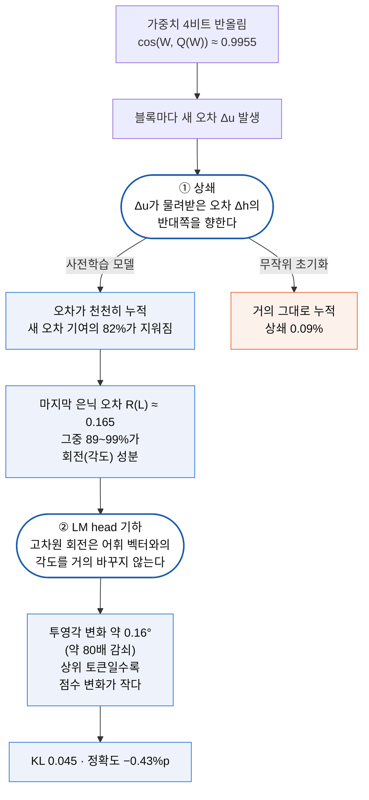

# Why Does PTQ Work: 4비트로 깎아도 LLM이 버티는 이유

- **논문**: [Why Does Post-Training Quantization Work?](https://arxiv.org/abs/2609.11716)
- **저자**: Yuxiang Chen, Michael Beyer, Jun Zhu, Jianfei Chen (칭화대, Bosch AI Research, 4명)
- **arXiv**: 2609.11716 [cs.LG], 2026-09-10 제출, v1 (preprint)
- **실험 환경**: 주 모델 Qwen3-32B. 가중치만 NVFP4 반올림(RTN, 보정 데이터 없음), LM head·임베딩·정규화는 BF16 유지. C4·WikiText-103·GSM8K 텍스트 각 64문장 × 512위치. 교차 검증 Qwen3 4B~32B·30B-A3B, OLMo3 7B·32B, OLMoE, Gemma3-4B, Pythia
- **읽은 날짜**: 2026-10-01
- **태그**: #Quantization #PTQ #NVFP4 #Interpretability #ResidualStream #LMHead

## 한 줄 요약

양자화한 가중치는 원래 가중치와 거의 같지만(cos 0.9955), **그것만으로는 설명이 안 된다.** 무작위 초기화 모델도 복원 오차가 똑같은데 은닉 오차가 5.5배 크다. 사전학습 모델에서는 두 장치가 차례로 작동한다. ① 각 블록이 새로 만든 오차가 **물려받은 오차의 반대쪽을 향해 일부를 지우고**(상쇄), ② 끝까지 남은 오차는 대부분 **회전**이라 고차원 LM head를 지나면서 약 80배 줄어들고, 특히 **상위 토큰의 점수가 가장 덜 흔들린다.**

## 읽는 방식

**원문 목차를 그대로 따라간다.** 절 번호와 제목이 원문과 같다. 마지막 세 절만 읽는 쪽에서 덧붙인 것이다.

전체 흐름은 다음과 같다.



---

## 1 Introduction

GPTQ, AWQ 같은 가중치 양자화는 이미 서빙 표준이다. 그런데 보정 없이 반올림만 해도 거의 손해가 없다. Qwen3-32B를 NVFP4로 바로 캐스팅하면 0-shot 벤치마크 6종 평균 정확도가 **0.43%p**만 떨어진다. 이 모델은 양자화 잡음을 겪으며 학습된 적이 없다.

흔한 설명은 "양자화한 가중치가 원래 값과 가깝다"이다. 저자들은 이것이 반쪽짜리라고 본다. **사전학습 모델과 무작위 초기화 모델의 복원 오차가 거의 같은데**, 은닉 상태 오차는 무작위 쪽이 5.5배 크다. 그렇다면 차이는 사전학습이 모델에 심어 둔 성질에서 온다.

기여는 셋이다.

1. 양자화 견고성을 **기전(mechanism)의 질문**으로 다시 세운다. 무작위 초기화와 비교해 "가중치가 가깝다"는 설명의 한계를 보인다
2. 오차 누적 속도를 **정확한 분해식**으로 나누고, 상쇄가 핵심 요인임을 개입 실험으로 확인한다
3. 남은 오차가 상위 토큰 예측을 거의 바꾸지 않는 이유를 **LM head 기하**로 이론화한다

## 2 Setup: Comparing Full-Precision and Quantized Models

같은 입력을 원래 모델 M과 양자화 모델 M̂에 넣고 블록마다 은닉 상태를 비교한다.

```
원래:   h⁽ℓ⁾ = h⁽ℓ⁻¹⁾ + u⁽ℓ⁾          u⁽ℓ⁾ = 블록 ℓ의 잔차 갱신 (Attention + MLP)
양자화: ĥ⁽ℓ⁾ = ĥ⁽ℓ⁻¹⁾ + û⁽ℓ⁾

은닉 오차   Δh⁽ℓ⁾ = ĥ⁽ℓ⁾ − h⁽ℓ⁾        (블록 ℓ까지 쌓인 오차)
갱신 오차   Δu⁽ℓ⁾ = û⁽ℓ⁾ − u⁽ℓ⁾        (블록 ℓ이 새로 만든 오차)
상대 오차   R⁽ℓ⁾ = ‖Δh⁽ℓ⁾‖ / ‖h⁽ℓ⁾‖
```

- **양자화 범위**: Attention·MLP의 선형 투영 가중치만 NVFP4로. LM head, 임베딩, 정규화, 활성값은 BF16
- **NVFP4**: 4비트 E2M1 값({0, ±0.5, ±1, ±1.5, ±2, ±3, ±4, ±6})에 16개 묶음마다 E4M3 스케일, 텐서마다 스케일 하나를 더 둔 형식(부록 D.1)
- **시뮬레이션**: 복원한 가중치를 계산 정밀도로 되돌려 곱한다. **수치 효과만 재고 4비트 커널의 속도나 메모리는 재지 않는다**
- **출력 지표**: 교차 엔트로피 변화(ΔCE), KL(p‖p̂), 1위 토큰이 바뀐 비율(Flip@1), 상위 K개 유지 비율(Ret@K)

## 3 The Growth of Hidden-Error Norm across Layers

### 3.1 Hidden-Error Growth in Randomly Initialized and Pretrained Models



- 사전학습 Qwen3-32B의 마지막 상대 오차는 약 0.15, 원래·양자화 은닉 상태의 cos은 약 0.98
- **가중치 복원 품질은 똑같다**: 사전학습과 무작위 초기화의 cos(W, Q(W))가 0.9955로 같고 상대 복원 오차도 9.48% 대 9.51%다(부록 Table 1, Qwen3 4B~32B·Pythia·OLMo3 공통)
- 그런데 무작위 초기화 Qwen3-32B의 마지막 은닉 오차는 절대값 5.5배, 상대값 6.7배 크다. OLMo3-7B의 학습 시작점(step 0)도 최종 체크포인트보다 절대 20.2배, 상대 3.7배 크다
- 무작위 초기화에서는 오차가 깊이에 따라 꾸준히 커진다(절대 ∝ ℓ^0.80, 상대 ∝ ℓ^0.30). 사전학습 모델은 뒤쪽 층에서 상대 오차 증가가 멈춘다

**가중치 차원의 유사성만으로는 깊이에 걸친 견고성을 설명할 수 없다.** 모델 쪽에 무작위와 사전학습을 가르는 기전이 있어야 한다.

### 3.2 Counteraction between Block-Input and Block-Update Errors


**제곱 오차 점화식(Prop. 1)**

```
‖Δh⁽ℓ⁾‖² − ‖Δh⁽ℓ⁻¹⁾‖² = ‖Δu⁽ℓ⁾‖² + 2⟨Δh⁽ℓ⁻¹⁾, Δu⁽ℓ⁾⟩
```

마지막 항이 음수인 경우를 **상쇄(counteraction)**라 부른다. 새 오차가 물려받은 오차의 일부를 지운다.

- 사전학습 Qwen3-32B, 블록 1~48: 상호작용 항이 새 오차 기여의 **50.2%를 누적으로 상쇄**
- 무작위 초기화: 층마다 0.16% 이하. 위 그림의 cos = 0인 경우에 해당한다

**상대 오차 점화식(Thm. 1)** 은 증가분을 세 항으로 나눈다.

| 항 | 뜻 | 사전학습 Qwen3-32B |
|---|---|---|
| T_add | 블록 갱신의 상대 오차가 입력의 상대 오차보다 큰 만큼 | 기준 (100%) |
| T_inter | 입력 오차와 갱신 오차의 부호 있는 상호작용. **상쇄가 여기 들어간다** | 63.4% 상쇄 |
| T_align | 갱신이 은닉 상태를 키워 상대 오차를 희석하는 효과 | 18.4% 상쇄, 주로 뒤쪽 층 |


두 항이 합쳐 T_add의 **81.8%**를 지운다. 무작위 초기화에서는 0.09%다.

### 3.3 Hidden-Error Growth without Counteraction

상쇄가 원인인지 확인하려고 개입한다. 블록 17~48(상쇄가 가장 강한 구간)에서 새 오차의 **크기는 그대로 두고 방향만** 바꾼다.

- **제거**: Δu를 물려받은 오차와 직교하는 방향으로 돌린다
- **반전**: 상호작용이 음수일 때 Δu의 부호를 뒤집는다


제거하면 최종 상대 오차가 2.94배, 반전하면 8.41배가 된다. 제거 후에는 T_add 자체도 4.3배 커진다. **상쇄는 음수 항으로 오차를 지울 뿐 아니라, 이후 궤적을 바꿔 새 오차가 덜 생기게도 한다.**

## 4 The Effect of Final Hidden Error on Output Quality

블록을 다 지난 오차는 0이 아니다. 세 데이터셋 평균 마지막 상대 오차는 약 0.245다. 이것을 **길이 차이**와 **각도 차이**로 나눈다(Prop. 2).

```
R² = (‖ĥ‖/‖h‖ − 1)²  +  2 (‖ĥ‖/‖h‖)(1 − cos∠(h, ĥ))
      길이 차이            각도(회전) 차이
```

각도 성분이 깊이 전체에서 제곱 오차의 **88.9~98.7%**를 차지한다. 은닉 상태의 크기는 거의 그대로이고 방향만 돈다. 마지막 정규화 뒤 LM head 입력은 평균 **12.47°** 회전한다.

### 4.1 Output Distributions and Downstream Accuracy after Quantization


| 지표 | C4 | WikiText-103 | GSM8K |
|---|---|---|---|
| ΔCE | +0.019 | +0.034 | +0.040 |
| 상대 ΔCE | +0.7% | +1.5% | +3.3% |
| KL(p‖p̂) | 0.045 | 0.090 | 0.079 |
| Flip@1 (1위 토큰이 바뀐 비율) | 10.7% | 12.7% | 8.3% |
| Ret@10 (상위 10개 유지) | 88.7% | 84.9% | 83.9% |
| Ret@20 | 88.9% | 84.2% | 82.5% |

다른 모델도 비슷하다(부록 Table 3). Qwen3-30B-A3B·Qwen3-8B·OLMo3-32B의 상대 ΔCE는 0.24~0.57%, KL은 0.019~0.060이다. 예시 위치에서 순위 29~30 토큰의 확률 변화는 순위 1~5의 2.5~4.4배다.

### 4.2 Preferential Preservation of Top-Ranked Scores and Probabilities

토큰 k의 점수는 z_k = ⟨w_k, h_LM⟩이다. LM head는 양쪽이 같으므로 점수는 **입력의 크기**와 **w_k와 이루는 각도**로만 바뀐다. 입력 크기 변화는 평균 3.7%로 작다. 그래서 각도를 본다.


**관찰 1. 투영각은 입력보다 훨씬 덜 바뀐다.** 입력이 12.5° 돌 때 어휘 평균 투영각 변화는 0.159°, 78.6배 감쇠다.

**관찰 2. 상위 토큰일수록 점수·로그확률 변화가 작다.** 순위가 내려갈수록 상대 점수 변화가 커지고, 무작위 초기화에서는 전 순위에서 훨씬 크다.

**Thm. 2 (등방 회전 가정)**: 회전 방향이 h_LM에 직교하는 방향 중 고르게 분포한다고 두면

```
E|θ̂_k − θ_k| ≈ α · μ_d,     μ_d ≈ √(2 / (π(d−1)))
E|Δz_k / z_k| ≈ α · |tan θ_k| · μ_d        (크기 변화 없음, ρ = 1)
```

- **투영각이 거의 안 바뀌는 이유**: 고차원(d = 5,120)에서는 회전의 대부분이 특정 w_k와 무관한 방향으로 간다. 예측 감쇠 1/μ_d ≈ 89.7배, 측정 78.6배
- **상위 토큰이 안정적인 이유**: 상대 점수 민감도가 |tan θ_k|에 비례한다. 상위 토큰은 h_LM과 이루는 각 θ_k가 작아서(부록 E.10) 같은 회전에도 점수가 덜 바뀐다

**Thm. 3** 은 점수 변화를 로그확률 변화로 잇는다. Δlog p_k = Δz_k − E_p[Δz] − KL(p‖p̂)가 정확한 항등식이고, 1·2차 근사가 순위별 추세를 재현한다.

KL이 작은 이유도 여기서 나온다. **KL은 원래 확률로 가중하는데, 확률이 큰 상위 토큰이 가장 잘 보존된다.** CE가 작은 이유는 정답 토큰의 확률이 평균적으로 거의 안 바뀌어서다.

## 5 Discussion

### 5.1 Consistency across Models, Quantization Settings, and PTQ Algorithms

- 상쇄는 Qwen, OLMo, Gemma의 dense·MoE 모델에서 모두 나타난다
- 블록별 cos(Δh, Δu) 곡선은 가중치만(W4), 활성값만(A4), 둘 다(W4A4) 양자화해도 대부분 블록에서 음수로 유지된다(Qwen3-32B)
- RTN, GPTQ, AWQ(Qwen3-4B, 모두 NVFP4)에서도 곡선 모양이 거의 같다. **보정 기반 PTQ가 상쇄 기하를 거의 바꾸지 않는다**
- 상위 토큰 보존과 투영각 감쇠도 6개 모델에서 반복된다(입력 회전 5.80~21.71°, 투영각 변화 0.093~0.391°)

### 5.2 Analysis of the Source of Counteraction

블록이 입력을 원래 반대로 미는 성질이 있는 것은 아니다. 은닉 상태와 갱신의 cos은 블록의 65.6%(원래), 64.1%(양자화)에서 **양수**다. 반면 **오차끼리의 cos은 82.5% 블록에서 음수**다.

갱신 오차를 둘로 나눈다.

| 성분 | 정의 | 상쇄 기여 |
|---|---|---|
| 직접 가중치 효과 | 같은 입력에서 가중치만 바꾼 차이 | 0.1% 미만 |
| 입력 오차 반응 | 같은 (양자화) 가중치에서 입력만 바꾼 차이 | **99.9%** |

두 성분의 크기는 비슷한데 상쇄는 거의 전부 **블록이 입력 오차에 반응하는 쪽**에서 나온다. 사전학습된 블록은 입력이 어긋나면 그 어긋남을 되돌리는 방향으로 갱신한다.

### 5.3 Rare Failures in Hidden-Error Propagation

드물게 상쇄가 감당하지 못하는 위치가 있다. 은닉 상태 크기가 원래와 크게 어긋나고, 극단값이 평균을 지배한다. 그래서 점화식 집계에서 **약 0.28%의 위치를 빼고** 따로 분석한다(부록 E.3). 크기 왜곡이 출력 실패로 이어지기도 하지만 항상은 아니다.

### 5.4 Limitations

- 다음 토큰 하나의 예측만 본다. **여러 토큰 생성으로 이어질 때는 다루지 않는다**
- 집계 통계에 기댄다. 개별 오차 궤적, 특히 극단 위치는 정밀하게 설명하지 못한다
- LM head 이론은 회전 방향이 고르다고 가정한다. 실제 회전 방향은 고르지 않을 수 있다
- 미해결: 상쇄가 학습의 확률적 성질(SGD의 암묵적 편향)에서 생기는가, 이 발견으로 PTQ를 개선할 수 있는가

## 6 Conclusion

사전학습 모델이 가중치 양자화 뒤에도 다음 토큰을 안정적으로 맞히는 이유는 두 기전이다. (1) 블록의 새 오차가 물려받은 오차를 거슬러 누적을 늦춘다. 이것을 없애면 최종 오차가 크게 늘어나므로 인과적 근거가 있다. (2) 끝까지 남은 오차는 주로 회전이고, 고차원 LM head에서는 그 회전의 작은 성분만 각 토큰 점수에 닿으며 상위 토큰일수록 덜 닿는다.

## Appendix (발췌)

### 사전학습 중 상쇄가 생기는 시점 (E.5)

OLMo3-7B Stage-1 체크포인트 6개, Pythia-1.4B·2.8B 체크포인트 4개(step 0, 10k, 50k, 최종 143k)에서 cos(Δh, Δu)가 0 근처에서 시작해 학습이 진행될수록 넓게 음수가 된다. OLMo3-7B의 마지막 상대 오차는 0.498(step 0)에서 0.136(최종)으로 줄어든다.

### 이상 위치 필터 민감도 (E.3, Table 2)


위치마다 블록 전체에서 은닉 상태 크기 차이의 최대값 g_max를 구해 0.5를 넘으면 뺀다. 마지막 상대 오차 평균은 거의 안 바뀌지만(0.148 → 0.147), **T_inter가 지우는 비율은 30.4%에서 50.4%로 달라진다.** 저자들은 "상쇄가 감당하는 범위를 넘은 드문 오차"로 해석한다.

---

## 읽을 때 감안할 것

- **핵심 수치가 필터에 민감하다.** 본문의 "상쇄가 50% 지운다"는 0.28%의 위치를 뺀 값이고, 전부 넣으면 30.4%다. 빠진 위치는 바로 상쇄가 실패한 위치이므로, 필터 후 수치는 "상쇄가 작동하는 위치에서 상쇄가 얼마나 작동하나"에 가깝다. 결론(상쇄가 있다)은 유지되지만 크기를 인용할 때는 두 값을 함께 적어야 한다. 필터 제거율도 본문 0.28%, 부록 0.08%(Qwen3-32B C4만)로 범위가 다르다.
- **상대 오차 수치가 절마다 다르다.** 3.1절 "약 0.15", 그림 1 "0.165", 4절 "약 0.245(세 데이터셋 평균)", 부록 Table 2 "0.147(모델·데이터 평균)"이다. 모두 틀린 것은 아니고 모델·데이터 범위가 다르다. 인용할 때는 어느 범위인지 밝혀야 한다.
- **정확도 −0.43%p의 대부분은 WinoGrande 하나다.** 6종 중 4종은 부트스트랩 SD 안의 변화이고 WinoGrande만 −2.37%p다. "거의 손해가 없다"는 평균 기준이며, 특정 과제에서는 2%p 넘게 떨어질 수 있다.
- **생성이 아니라 한 위치 예측이다.** GSM8K도 정답 풀이를 넣고 다음 토큰을 맞히는 teacher forcing이라 실제 풀이 정확도가 아니다. Flip@1이 8~13%라는 것은 그리디 생성에서 열 토큰 중 하나꼴로 다른 토큰이 나온다는 뜻이다. 그 차이가 긴 생성에서 어떻게 번지는지는 이 논문 범위 밖이다.
- **가중치 전용 RTN 시뮬레이션이 주 실험이다.** 활성값 양자화와 GPTQ·AWQ는 상쇄 곡선 모양만 비교했고(W4A4는 Qwen3-32B, PTQ 비교는 Qwen3-4B 8개 입력), 정확도까지 같은 깊이로 보지 않았다. 4비트 커널의 실제 속도·메모리도 재지 않았다.
- **KV 캐시 양자화와는 다른 대상이다.** 이 논문은 블록의 선형 가중치를 다룬다. [DeepSeek-V4.1-Flash 노트](%5B20260911%5D%20DeepSeek-V4.1-Flash_KV_Cache_Compression.md)의 FP4 KV 캐시는 주의 연산의 입력을 깎는 것이라 같은 기전이 그대로 적용된다는 근거는 없다.

## 가져갈 지점

1. **"가중치 오차가 작다"는 양자화 검증이 되지 않는다**

   복원 cos 0.9955는 무작위 초기화 모델에서도 똑같이 나왔다. 양자화 품질 점검은 가중치 차원이 아니라 **은닉 상태와 출력 분포 차원**에서 해야 한다. 최소한 층별 상대 오차 R⁽ℓ⁾와 KL, Flip@1을 같이 본다.

2. **양자화 영향은 평균보다 과제별·위치별로 본다**

   평균 −0.43%p 안에 WinoGrande −2.37%p가 들어 있고, 0.28%의 위치에서는 상쇄가 무너진다. 서빙 전 검증에서 평균 정확도 하나로 통과시키지 말고 **가장 많이 떨어진 과제와 KL 꼬리**를 따로 확인한다.

3. **상위 토큰 지표와 하위 토큰 지표를 구분한다**

   상위 토큰은 보존되고 꼬리 토큰의 확률은 2.5~4.4배 더 흔들린다. 그리디·낮은 온도 생성에는 유리하지만, **샘플링 온도가 높거나 logprob 꼬리를 쓰는 용도**(신뢰도 추정, 판정기 확률, 다양성 샘플링)에서는 양자화 영향이 더 크게 보일 수 있다. [JEV-as-a-Judge 노트](%5B20260928%5D%20JEV-as-a-Judge_Confidence_Cascade.md)처럼 라벨 확률을 쓰는 판정기를 양자화 모델로 돌린다면 보정 상태를 다시 확인해야 한다.

4. **LM head를 BF16으로 남기는 관행의 근거**

   두 번째 기전은 LM head가 원래 정밀도라는 전제에서 나왔다. 회전을 걸러주는 장치가 LM head 행 벡터의 기하이므로, LM head까지 양자화하면 이 보호가 약해질 수 있다(논문은 이 경우를 실험하지 않았다).

5. **"자기 교정"을 진단 지표로 쓸 수 있다**

   cos(Δh⁽ℓ⁻¹⁾, Δu⁽ℓ⁾)는 원래·양자화 두 번의 순전파만 있으면 블록별로 계산된다. 블록별로 이 값이 0 근처이거나 양수인 구간은 상쇄가 약한 곳이라 **혼합 정밀도에서 높은 정밀도를 줄 후보**가 된다. 저자들도 "PTQ 개선에 쓸 수 있는가"를 미해결로 남겼다.

## 결론

이 논문의 가치는 새 양자화 기법이 아니라 **"왜 되는가"에 대한 측정 가능한 답**이다. 가중치가 가깝다는 설명을 무작위 초기화라는 대조군 하나로 반박하고, 정확한 분해식과 개입 실험으로 상쇄를 인과적 요인으로 세웠다. LM head 쪽은 고차원 기하 정리로 측정값(78.6배)과 예측값(89.7배)을 맞췄다.

인용할 때는 두 가지를 같이 적는다. 상쇄 비율은 필터에 따라 30~50%이고, 결과는 한 토큰 예측 기준이다. 실무에 가져갈 것은 **양자화 검증을 가중치가 아닌 은닉 상태와 출력 분포에서, 평균이 아닌 꼬리에서 하라**는 원칙이다.
